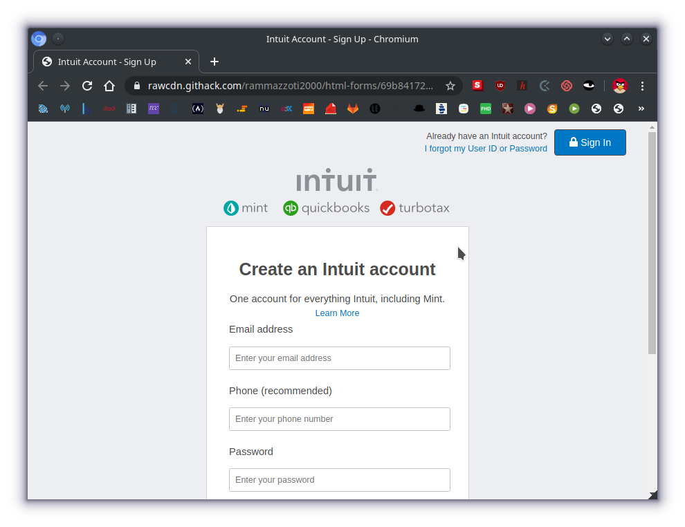

# Html Forms Project

> This is a project for the Sign up form of a website called intuit This is only a prototype of the Sign up page so its not functional

Rebuild of the form [Mint.com](https://accounts.intuit.com/signup.html?offering_id=Intuit.ifs.mint&namespace_id=50000026&redirect_url=https%3A%2F%2Fmint.intuit.com%2Foverview.event%3Ftask%3DS#) page for signing up new users.

## Built With

- Html,
- CSS,
- Linters,
- Stickler,
- Atom :atom:

## Live Demo

[Live Demo Link](https://rawcdn.githack.com/rammazzoti2000/html-forms/69b84172f6e48dba3d277b84f98b419266bbd846/index.html)

## Automated Test
> There are no automated tests for  this project yet.

## Authors

👤 **Author1**

- Github: [@sddoe](https://github.com/sddoe)
- Linkedin: [Sergio David Perdomo Rivera](https://www.linkedin.com/in/sergio-david-perdomo-rivera-07b6b7b8/)

👤 **Author2**

- Github: [@rammazzoti2000](https://github.com/rammazzoti2000)
- Linkedin: [Alexandru Bangau](https://www.linkedin.com/in/alexandru-bangau/)

## 🤝 Contributing

Contributions, issues and feature requests are welcome! Start by:
* Forking the project
* Cloning the project to your local machine
* `cd` into the project directory
* Run `git checkout -b your-branch-name`
* Make your contributions
* Push your branch up to your forked repository
* Open a Pull Request with a detailed description to the development branch of the original project for a review

## Show your support
Give a :star: if you like this project.

## 📝 License

This project is [MIT](https://opensource.org/licenses/MIT) licensed.

